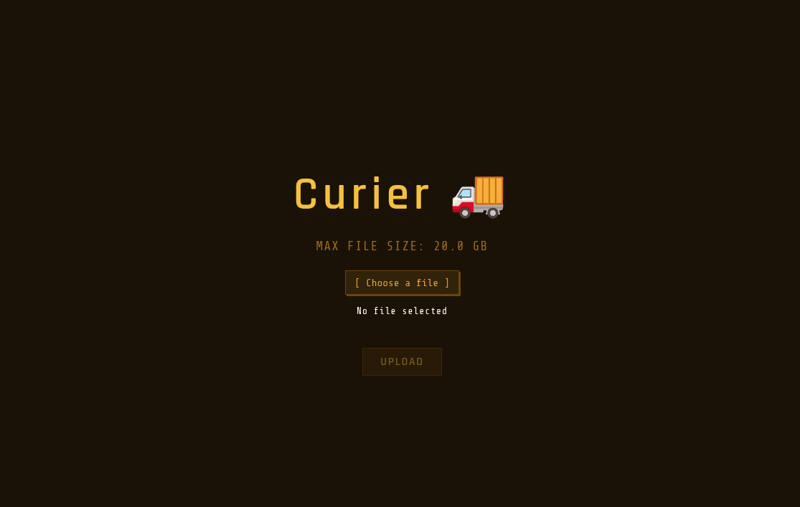
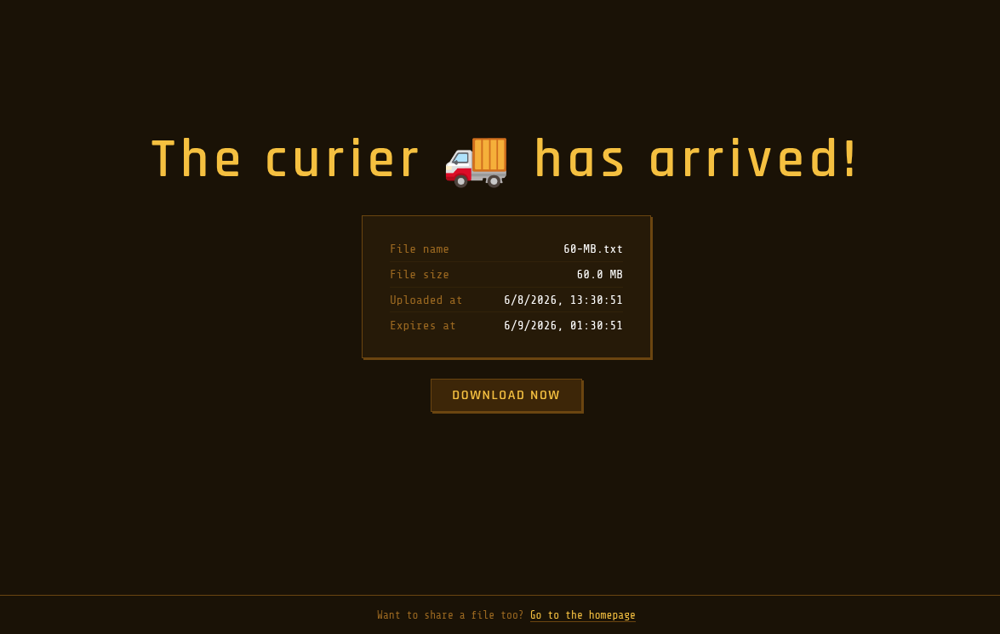

# curier 🚚




A small Go server for sharing files across the internet.

## How to setup

### Docker

You can download the Dockerfile and build the image yourself, or simply pull it from the repo:
```bash
docker pull ghcr.io/adipeterca/curier:latest
docker run -p 39800:39800 \
-v ./uploads/:/uploads \
ghcr.io/adipeterca/curier:latest
```

### Linux & Windows

Please refer to the [Release](https://github.com/adipeterca/curier/releases) section.

## Configuration

You can configure some aspects of the service via environment variables prefixed with **CURIER_**.  

_If you're using Docker, either use a `.env` file or the `-e` argument from the `docker run` command._

Some information will be exposed via the `/config/` endpoint for better UX.  
For default values, check [config.go](https://github.com/adipeterca/curier/blob/main/config.go).  

| Variable name | Description |
|--|--|
|`CURIER_STORAGE_PATH`|Absolute path where the file uploads will be stored on disk|
|`CURIER_HOST`|Network address to bind to|
|`CURIER_PORT`|Port to use (also affects the port used inside the container)|
|`CURIER_FILE_RETENTION_TIME`|How many hours (minimum 1) to keep the files on disk|
|`CURIER_MAX_FILE_SIZE`|Maximum allowed size for each file upload|
|`CURIER_ALLOWED_FILE_EXTENSIONS`|A `;` separated list of file extensions, lowercase only (the last entry needs to have a `;` too)|

## Technical details

In no particular order:
- the application uses cryptographically secure IDs (128-bit randomness) to reference uploaded files
- files expire and get deleted automatically
- it comes as a single binary, with no external dependencies
- the frontend has some UX elements that prevent a user from uploading an invalid / unaccepted file (however, **THIS IS DONE PURELY AS A UX FEATURE, NOT A SECURITY FEATURE**)